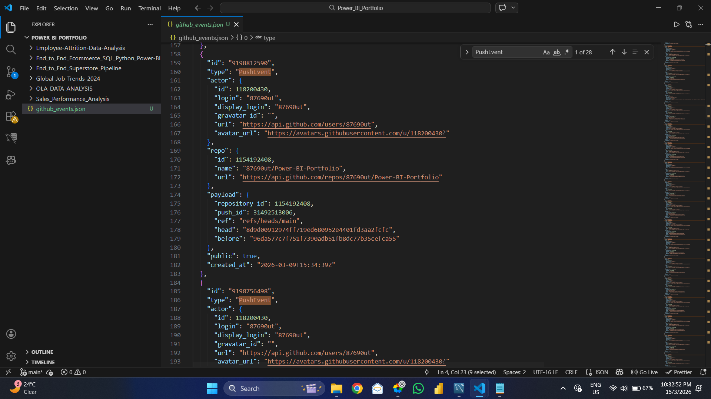

# End-to-End CFO Financial Analytics Pipeline 📊

**Author:** Uttam Tiwari
**Role:** Data Analyst / BI Developer

## 📌 Project Overview
This project is a complete End-to-End Data Analytics pipeline designed for executive-level decision-making. The goal was to transform raw, unstructured financial data into a dynamic, app-style Power BI dashboard that provides real-time insights into global sales, profit trends, and market segments. 

Unlike standard visualization projects, this pipeline integrates **Python for ETL**, **MySQL for data warehousing**, and **Power BI for advanced business intelligence**, mimicking a real-world enterprise data workflow.

## 🛠️ Tech Stack & Architecture
* **Data Cleaning & Preprocessing:** Python (Pandas, NumPy)
* **Database & Pipeline Bridge:** MySQL, SQLAlchemy
* **Business Intelligence & UI/UX:** Power BI (DAX, Power Query)

## ⚙️ Pipeline Methodology

### Phase 1: Data Extraction & Transformation (Python)
* Imported raw financial datasets and performed rigorous exploratory data analysis (EDA) using Pandas.
* Handled missing values, standardized data types (e.g., date-time conversions, currency formatting), and removed anomalies.
* Engineered new features to categorize discount bands and calculate accurate profit margins.

### Phase 2: Database Integration (MySQL)
* Created a seamless bridge between the Python environment and a local MySQL database using the `SQLAlchemy` engine.
* Pushed the cleaned dataframe directly into a relational database architecture.
* Executed complex SQL queries to validate data integrity, perform aggregations, and extract preliminary business logic before feeding it to the BI tool.

### Phase 3: Advanced BI Visualization (Power BI)
Connected Power BI directly to the MySQL database and built a scalable, dark-themed 'App-Style' dashboard. 
**Key Technical Features:**
* **App-Style Navigation:** Built a custom left-side navigation panel using responsive tile slicers (Year, Product) instead of standard dropdowns for a seamless user experience.
* **Custom Report Page Tooltips:** Engineered drill-down capabilities without cluttering the main canvas. Hovering over the 'Country' bar chart triggers a secondary Donut chart (Sales by Product), and hovering over 'Segments' reveals a Treemap breakdown.
* **Conditional Formatting (Heatmaps):** Applied dynamic `fx` logic to the Country Bar Chart, where bar length represents Total Sales, but the gradient color intensity indicates Net Profit, instantly highlighting high-volume/low-profit regions.
* **Time Intelligence:** Bypassed default auto-date/time constraints by creating custom chronological hierarchies to accurately map profit trends over fiscal quarters and months.

## 📈 Key Business Insights Derived
1. Identified top-performing products disguised by high discount dependencies.
2. Mapped global profitability, revealing specific countries with high sales volume but diminishing profit margins.
3. Segmented market performance, providing the CFO with clear visibility into 'Government' vs. 'Midmarket' revenue streams.

## 📸 Dashboard Snapshot

