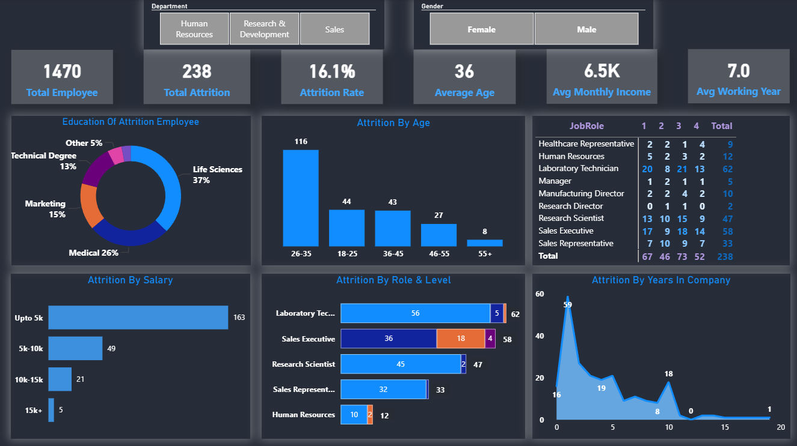

# 📊 HR Employee Attrition Analytics Dashboard

**Author:** Uttam Tiwari  
**Role:** Data Analyst / BCA Student  

## 🎯 Project Overview
This project focuses on analyzing Employee Attrition (the rate at which employees leave a workforce) for a fictional company. The goal of this Power BI dashboard is to uncover deep insights into *why* employees are leaving, *who* is leaving, and provide data-driven recommendations to the HR department to improve employee retention.

## 🛠️ Tools & Technologies Used
* **Tool:** Microsoft Power BI
* **Data Transformation:** Power Query (Data cleaning, handling blank values, trimming)
* **Data Modeling:** Star Schema (Fact and Dimension tables, 1-to-Many relationships)
* **Calculations:** DAX (Data Analysis Expressions) for dynamic measures
* **UI/UX Design:** Custom interactive layout with transparent visuals, tile slicers, and clean data labels.

## 💡 Key Business Insights (Data Story)
Based on the dashboard analysis of 1,470 employees (Overall Attrition Rate: 16.1%):
1. **Salary Impact:** The highest attrition (163 employees) is observed among staff earning **Under 5k**. As salary crosses the 5k mark, attrition drops significantly.
2. **Age Factor:** The **26-35 age group** is the most volatile, with 116 employees leaving, indicating a search for better career growth or compensation.
3. **Experience Level:** A major spike in attrition occurs during the **first 1 to 2 years** of employment. Employees who cross the 5-year mark tend to stay longer.
4. **Job Role Vulnerability:** **Laboratory Technicians** (62) and **Sales Executives** (58) show the highest turnover rates.
5. **Educational Background:** 37% of the employees who left belong to the **Life Sciences** background.

## Dashboard Previev-

## ⚙️ Steps Taken in this Project
1. **Data Cleaning:** Removed anomalies and handled blank categories in Power Query.
2. **Data Modeling:** Built a robust Star Schema connecting the main Fact table with supporting Dimension tables to enable smooth filtering.
3. **DAX Measures:** Created dynamic measures for Total Employees, Total Attrition, Attrition Rate, Average Age, etc.
4. **Dashboard Formatting:** * Designed a dark-themed, corporate-level UI.
   * Applied "Tile" and "Dropdown" interactive Slicers for seamless cross-filtering by Department and Gender.
   * Optimized visual clarity by removing gridlines, standardizing colors, and using custom tooltips to reveal hidden data points.

## 🚀 Actionable Recommendation for HR
To reduce the 16.1% attrition rate, the company should focus on revising the starting salary packages (above 5k) for newly joined employees (0-2 years experience), specifically targeting the 26-35 age group in Laboratory Technician and Sales Executive roles.
