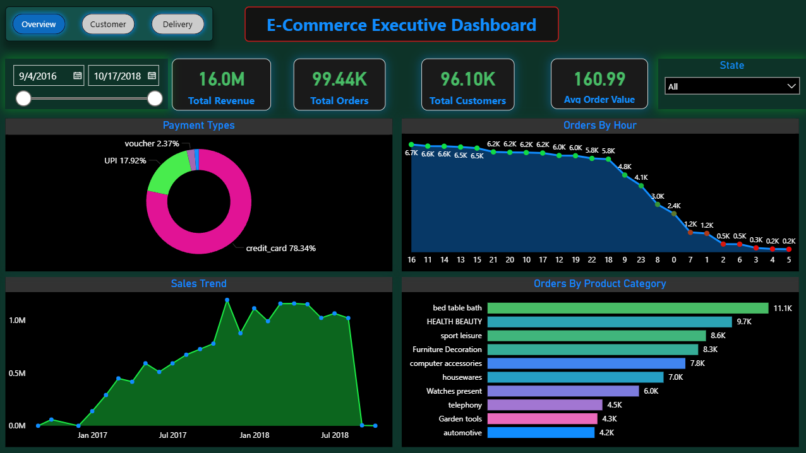
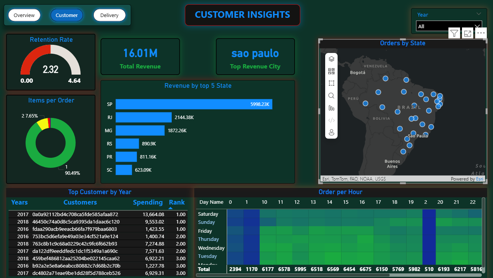
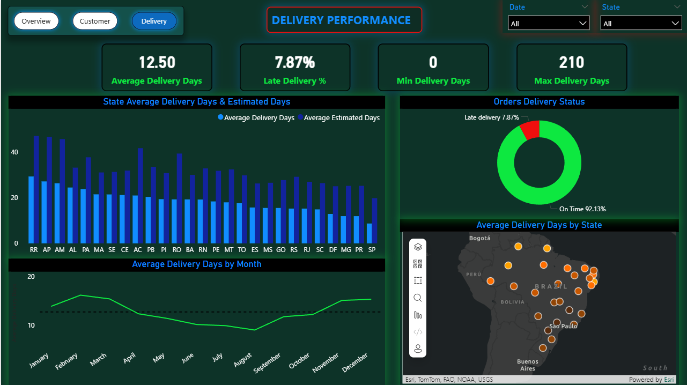

# 🛒 End-to-End E-Commerce Data Analysis Project
### *From Raw Data to Strategic Insights using Python, SQL & Power BI*


## 👨‍💻 Project Overview
This project is a full-cycle data analysis of a Brazilian E-Commerce giant (Olist Store). Instead of just visualizing data, I handled the entire pipeline: **Data Cleaning in Python**, **Complex Logic in SQL**, and **Final Presentation in Power BI**.

The goal was to solve critical business problems like **Customer Churn (97%)** and **Delivery Delays**, handling a dataset of **100k+ orders**.

---
## Note: Due to large file size of the raw dataset, it is hosted on Google Drive for esy ccess.
* **Download Raw data:* [👉 Click Here to Access Dataset](https://drive.google.com/drive/folders/1X943cFDVz9M7Xooxkl6BQ2bJRWBOA6Q1?usp=sharing)
## 🛠️ The Tech Stack & Workflow

My approach wasn't linear. I used the best tool for each specific problem:

1.  **Python (Pandas/NumPy):** Used for initial Exploratory Data Analysis (EDA) and answering specific statistical questions.
2.  **SQL (MySQL):** Used to extract complex datasets (e.g., calculating Retention Rate, identifying Top Customers) that were too heavy for Power BI to process directly.
3.  **Power BI:** Used for the final interactive dashboard and storytelling.

---

## 🧠 Phase 1: Python & SQL Logic (The Backend Grind)

Before opening Power BI, I solved the hardest questions using code.

### 🐍 Python Analysis
I used Python to clean null values and understand the distribution of data.
* *Performed data cleaning to handle missing delivery dates.*
* *Merged 8 different CSV files into a usable master dataset for analysis.*

### 🗄️ SQL Queries (The Brain)
Power BI is for visuals, but SQL is for logic. I wrote complex queries to calculate metrics that didn't exist in the raw data.

**Example: Calculating Customer Retention Rate (The Hardest Metric)**
I wrote a SQL query to find customers who placed more than one order.

```sql
-- Identifying Recurring Customers
SELECT 
    COUNT(DISTINCT customer_unique_id) as retained_customers
FROM orders 
WHERE customer_unique_id IN (
    SELECT customer_unique_id 
    FROM orders 
    GROUP BY customer_unique_id 
    HAVING COUNT(order_id) > 1
);
-- Result: Only 2.32% Retention Rate (A major business alarm).
```

---

## 🔧 Phase 2: The "Troubleshooting" (Solving Real Problems)

A project isn't real without errors. Here are the major roadblocks I faced and how I engineered solutions for them:

### 🔴 Problem 1: The "Geo-Mapping" Crisis
* **The Issue:** The dataset contained city names like "Santa Maria" and "Colorado". Power BI blindly mapped these to locations in the **USA and Europe**, making the map useless.
* **The Fix:** I realized `City` wasn't unique. I created a new calculated column in DAX to force geographical context.
    ```dax
    Location_Fixed = customers[customer_city] & ", Brazil"
    ```
    *Result: 100% accurate mapping to South America.*

### 🔴 Problem 2: Performance & File Bloat
* **The Issue:** The Power BI file size exploded to **50MB+**, causing lag.
* **The Fix:**
    1.  I audited the columns and removed high-cardinality, unused text columns (like `product_description`) using Power Query.
    2.  I disabled "Auto Date/Time" in global settings.
    *Result: File size reduced by 60%, dashboard became instant.*

### 🔴 Problem 3: Logic Mismatch (Dates)
* **The Issue:** Management wanted to know "Late Delivery %", but the data only had dates, not statuses.
* **The Fix:** I wrote a dynamic DAX formula to classify every single order.
    ```dax
    Delivery Status = IF(orders[order_delivered_customer_date] > orders[order_estimated_delivery_date], "Late", "On Time")
    ```

---

## 📊 Phase 3: The Final Dashboard (Power BI)

After solving the data issues, I built a 3-page interactive report mimicking a modern App.

### Page 1: Executive Overview
Focused on high-level KPIs (Revenue, Orders, Trends) for the CEO.



### Page 2: Customer Insights
Focused on behavior. Includes the **Heatmap Analysis** (Day vs. Hour) and **Retention Gauge**.



### Page 3: Delivery Operations
Focused on logistics. Features **Slicers (Date, State)** to filter "Late Deliveries" and identify bottleneck states like Rio de Janeiro (RJ).



---

## 💡 Key Business Recommendations

Based on my analysis across Python, SQL, and Power BI:
1.  **Fix the Churn:** With a 97% churn rate, the company is bleeding customers. Immediate loyalty programs are needed.
2.  **Optimize Logistics in North:** The map shows Northern states have an average delivery time of 20+ days (vs. 12 days national avg).
3.  **Target Weekdays:** The Heatmap proves that marketing ads should run Mon-Fri, 10 AM - 4 PM. Weekend ads are burning cash with low ROI.

---
*Created by **Uttam Tiwari** | Data Analyst Portfolio*
*Showcasing: SQL Logic, Python Cleaning, Power BI Visualization, and Problem Solving.*
